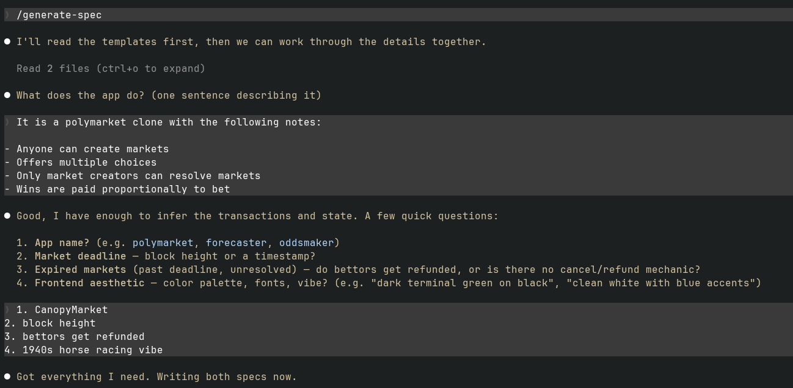
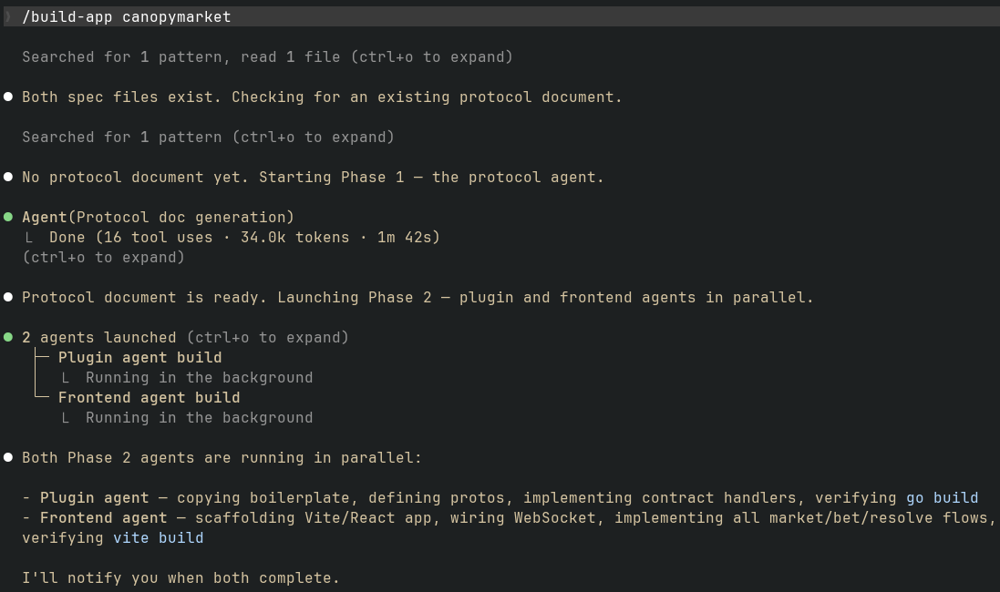
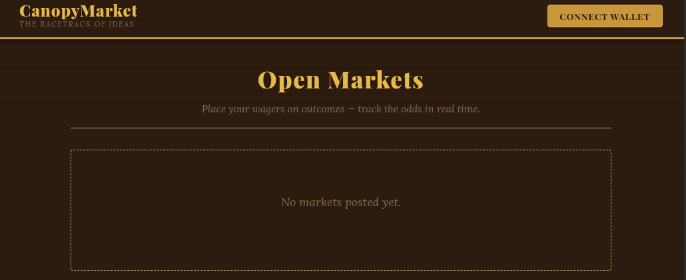
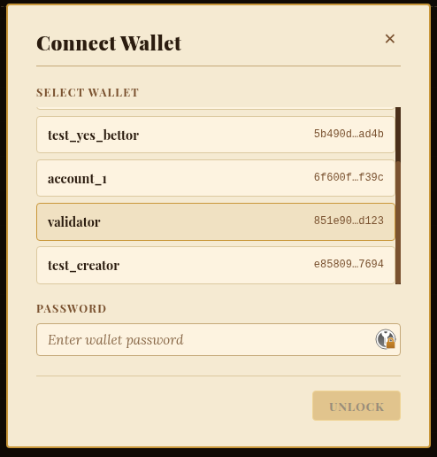
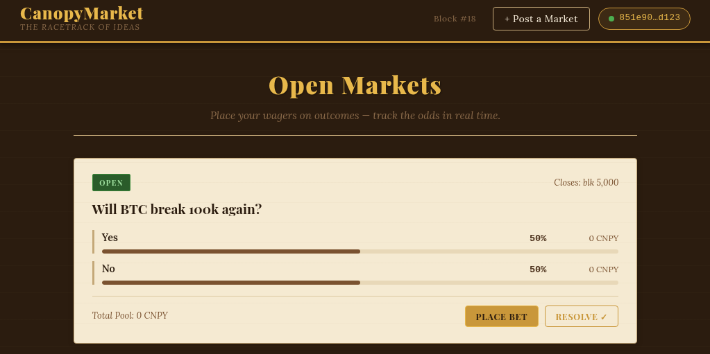

= Building a Canopy App: From Spec to App
:toc: left
:toc-title: Contents
:sectnums:
:source-highlighter: highlight.js
:icons: font
:docinfo: shared

== Introduction

Canopy lets you deploy custom blockchain logic as plugins — Go processes that the FSM calls into for transaction validation, state writes, and block lifecycle hooks. Each plugin pairs with a web frontend that talks to it over WebSocket in real time.

Two SDKs support this workflow. The Go SDK provides a shared WebSocket server for plugins — handling client connections, topic subscriptions, and broadcasts.

The TypeScript SDK (`canopy-crypto`) handles the browser side: wallet decryption, transaction signing, and protobuf encoding compatible with Canopy's Go implementation.

This guide walks through the full workflow: writing a spec, generating the plugin and frontend, and running everything locally. We use a simple guestbook app as the example throughout. The <<_building_the_app>> and <<_running_the_frontend>> sections cover how to build and start both sides.

We assume the Canopy binary is in $PATH and has a config in `~/.canopy`.

****
The plugin and frontend are separate processes. Canopy starts the plugin automatically on launch via `pluginctl.sh`, while the frontend is a standalone Vite dev server you start separately.
****

== Prerequisites

* Canopy installed and configured
* Go 1.25+
* Node.js 20+
* `protoc` and `protoc-go-inject-tag` in PATH

=== Environment Setup

Create a `.env` file in the `canopy-llm` directory with the path to the Canopy plugin source:

[source,bash]
----
CANOPY_SRC=/path/to/canopy/plugins
----

`CANOPY_SRC` points to the Canopy source directory. The build agent reads this at the start of every session and copies `$CANOPY_SRC/plugin/go` into your new plugin directory during generation.

== Writing a Spec

Every app starts with two spec files: one for the plugin (backend) and one for the frontend. The `generate-spec` skill walks you through creating both.

Run `/generate-spec` in Claude Code.



The skill will ask what your app does, then walk through the key sections interactively — transaction types, state objects, business logic, UI features — and write the completed spec(s) to `specs/`.

TIP: The templates behind the skill live at `specs/template-plugin.md` and `specs/template-frontend.md`. They're a menu, not a checklist — skip sections and the build agent will make reasonable assumptions.

Keep specs concise. Describe *what* the app does, not *how* to code it. Expand the examples below to see a complete guestbook spec for each.

=== Plugin Spec

The plugin spec defines transaction types, state objects, business logic, and WebSocket events.

[%collapsible]
.Example guestbook plugin spec
====
[source,markdown]
----
# On-Chain Guestbook Plugin

This plugin adds a public guestbook to the Canopy blockchain. Anyone with a
wallet can post a short message on-chain.

## Transaction types

- **post_message** — any funded account can post a message. Fields:
  sender_address (bytes), message (string, max 280 chars)

## State objects

- **Message** — id (uint64), author_address (bytes), content (string), height (uint64)
- **MessageCounter** — next_id (uint64)

## Business logic details

### post_message
- Validate: sender_address is 20 bytes
- Validate: message is not empty and len(message) <= 280
- Increment MessageCounter, assign id = counter.next_id
- Store Message with id, author_address, content, and current block height

## WebSocket events

The plugin runs a WebSocket server on port 36660 (`/ws`).

### EndBlock
Broadcast the last 50 messages ordered by id descending:
```json
{ "type": "end_block", "height": 123, "messages": [...] }
```
----
====

=== Frontend Spec

The frontend spec defines the visual style, wallet flow, and UI behavior.

[%collapsible]
.Example guestbook frontend spec
====
[source,markdown]
----
# On-Chain Guestbook — Frontend Specification

A web frontend for the Canopy Guestbook plugin. Users can connect a wallet,
post short messages to the blockchain, and watch a live feed of all messages.

Read the backend plugin guestbook-plugin/plugin/go to understand how the
plugin works before building.

Use a dark terminal aesthetic — near-black background (#0D1117), bright green
accent (#00FF88), monospace font for messages.

---

## Key Constraints

- Messages are immutable once posted. No edit or delete.
- Max message length is 280 characters. Show a live character counter.
- WebSocket updates must not cause full re-renders. Reconcile in-place using
  a `useReducer` pattern with a `Map<id, Message>`.

---

## Features

### Global Navigation
- **Wallet adapter** top-right: "Connect Wallet" when disconnected.
- **Keystore** — load wallets from Canopy node API; password unlocks session.

### Post Message Form
Fields:
- **Message** — textarea, max 280 chars, with live character counter
- **Post** button (enabled when wallet connected and message non-empty)

On submit:
- Submits `post_message` transaction
- Clears textarea on success

### Message Feed
Scrolling feed, newest first. Each card shows author address, content, and
block height. New messages animate in via WebSocket end_block events.
----
====

== Building the App

Once your specs are ready, run `/build-app <name>`.



It will copy `plugin/go` from `$CANOPY_SRC` into `<name>-plugin/plugin/go`, define proto messages, implement `CheckTx` and `DeliverTx` handlers, and wire up the WebSocket broadcast in `EndBlock`.

=== Building and Running

Build the plugin binary, then start Canopy from the project root:

[source,bash]
----
cd guestbook-plugin/plugin/go
make build      # Compiles the plugin to ./go-plugin
cd ../..        # Back to guestbook-plugin/ — Canopy must run from here
canopy start    # Canopy calls plugin/go/pluginctl.sh start automatically
----

Here's how Canopy resolves and launches the plugin:

. It reads `"plugin": "go"` from `~/.canopy/config.json`. This is a directory name, not a path — path separators and `..` are rejected.
. It constructs the path `plugin/<name>/pluginctl.sh` relative to the current working directory, substituting the config value for `<name>` — so `"plugin": "go"` becomes `plugin/go/pluginctl.sh`.
. It executes `pluginctl.sh start`, which spawns the `go-plugin` binary in the background.
. It opens a Unix socket at `/tmp/plugin/plugin.sock` and waits for the plugin to connect.

This is why `canopy start` must be run from `<name>-plugin/` — the generated directory structure `<name>-plugin/plugin/go/` matches what Canopy expects to find.

WARNING: The `plugin` value in `~/.canopy/config.json` must be a plain directory name like `go`. Canopy rejects values containing path separators or `..`.

Plugin logs go to `/tmp/plugin/go-plugin.log`. You can check status or stop the plugin manually with `./plugin/go/pluginctl.sh status` and `./plugin/go/pluginctl.sh stop`.

== Running the Frontend

[source,bash]
----
cd guestbook-frontend
npm install   # Installs dependencies and links the canopy-crypto SDK
npm run dev   # Starts Vite dev server with proxy rules
----

Vite proxies `/v1/` and `/ws` to the Canopy node, so there's no CORS configuration needed and the frontend works against a local node out of the box.

NOTE: The frontend connects to the plugin's WebSocket server via the Vite proxy. If you see WebSocket connection errors, verify that the plugin is running and its WebSocket server started on port 36660.








[%collapsible]
.Vite proxy configuration reference
====
[source,typescript]
----
// vite.config.ts
export default defineConfig({
  server: {
    proxy: {
      "/v1/admin": { target: "http://localhost:50003" },
      "/v1/query": { target: "http://localhost:50002" },
      "/v1/tx":    { target: "http://localhost:50002" },
      "/ws":       { target: "ws://localhost:36660", ws: true },
    },
  },
});
----
====

== Conclusion

The workflow is intentionally minimal: write a spec, run `/build-app`, build the plugin, and start Canopy. The templates in `specs/template-plugin.md` and `specs/template-frontend.md` are the starting point for any new app in this repo.
